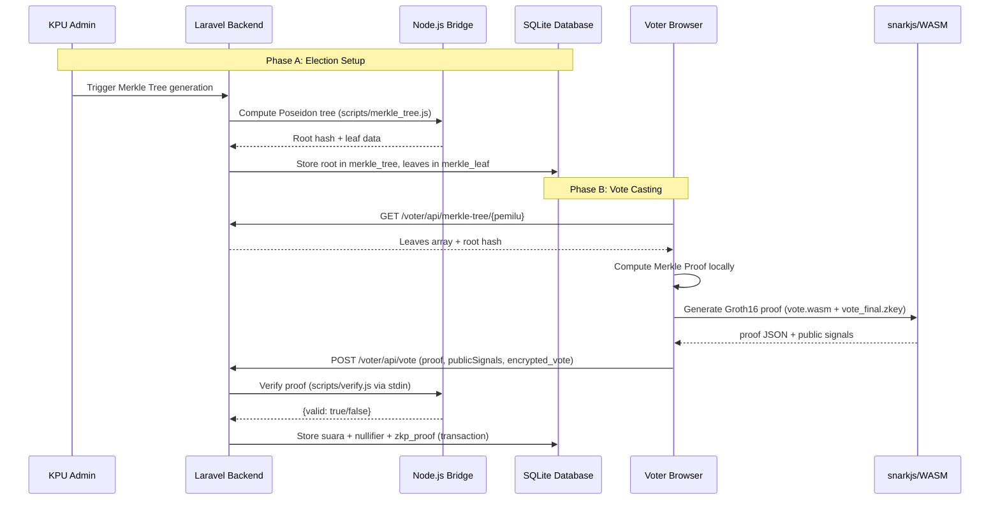
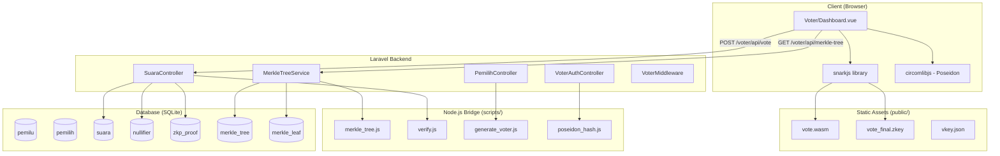
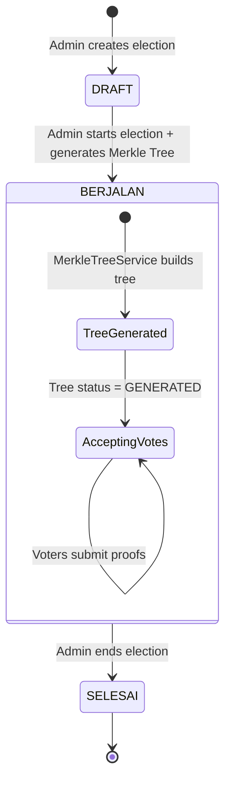
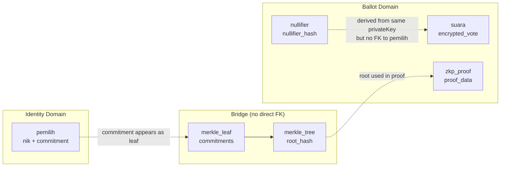

# Design Document: zk-SNARK Ballot Engine

## Overview

The zk-SNARK Ballot Engine is the cryptographic core of the JUNED E-Voting System. It enables voters to prove their eligibility and cast ballots without revealing their identity, using Groth16 zero-knowledge proofs built on the BN254 elliptic curve with Poseidon hashing.

The system follows a split-trust architecture:
- **Client-side (browser)**: Proof generation using snarkjs + WASM witness calculator
- **Server-side (Laravel + Node.js subprocess)**: Proof verification, nullifier checking, vote persistence

Key privacy guarantee: There is no direct database join between the `pemilih` (voter) table and the `suara` (ballot) table. The only link is the cryptographic nullifier, which prevents double-voting without revealing voter identity.

### Technology Stack

| Layer | Technology |
|-------|-----------|
| Backend Framework | Laravel 13 (PHP 8.3) |
| Frontend Framework | Vue 3 + Inertia.js |
| Database | SQLite (development) |
| CSS | Tailwind CSS |
| ZKP Circuit | circom 2.0 (BN254/Groth16) |
| ZKP Library | snarkjs (browser + Node.js) |
| Hash Function | Poseidon (via circomlibjs) |
| Trusted Setup | Powers of Tau (2^14) |

## Architecture

### High-Level Component Interaction



### System Architecture Diagram



### Election Lifecycle Flow



## Components and Interfaces

### 1. MerkleTreeService (PHP + Node.js Bridge)

**Location:** `app/Services/MerkleTreeService.php`

**Purpose:** Constructs and manages the Poseidon-based Merkle Tree of voter commitments. Since PHP lacks a native Poseidon implementation compatible with the BN254 field, this service delegates hashing to a Node.js script via `shell_exec`.

```php
<?php

namespace App\Services;

use App\Models\MerkleTree;
use App\Models\MerkleLeaf;
use App\Models\Pemilih;

class MerkleTreeService
{
    private const TREE_DEPTH = 10;
    private const MAX_LEAVES = 1024; // 2^10

    /**
     * Build the Merkle Tree for an election.
     * Collects all voter commitments, pads to 1024, delegates to Node.js for Poseidon hashing.
     */
    public function buildTree(int $pemiluId): MerkleTree;

    /**
     * Get the Merkle Proof (path elements + path indices) for a given commitment.
     */
    public function getProof(int $pemiluId, string $commitment): array;

    /**
     * Get all leaves and root for client-side proof computation.
     */
    public function getTreeData(int $pemiluId): array;
}
```

**Node.js Bridge Script:** `scripts/merkle_tree.js`

Accepts JSON via stdin with an array of leaf commitments (as decimal strings), computes the full Poseidon Merkle Tree, and outputs the root hash plus all intermediate nodes.

```
Input (stdin):  {"leaves": ["123456...", "789012...", ...], "depth": 10}
Output (stdout): {"root": "...", "nodes": [[level0...], [level1...], ...]}
```

### 2. SuaraController (Vote Submission)

**Location:** `app/Http/Controllers/SuaraController.php`

**Purpose:** Receives vote submissions, orchestrates proof verification, nullifier checking, and atomic vote persistence.

```php
<?php

namespace App\Http\Controllers;

class SuaraController extends Controller
{
    /**
     * POST /voter/api/vote
     * 
     * Request payload:
     * - proof: object (Groth16 proof JSON: pi_a, pi_b, pi_c, protocol, curve)
     * - publicSignals: array of 4 strings [nullifierHash, root, pemiluId, kandidatId]
     * - encrypted_vote: string (Poseidon commitment of kandidatId + randomSecret)
     * - nullifier_hash: string (decimal string of Poseidon(privateKey, pemiluId))
     * - pemilu_id: int
     */
    public function store(Request $request): JsonResponse;
}
```

**Verification Flow:**
1. Validate request payload structure
2. Verify election status is `BERJALAN`
3. Invoke `scripts/verify.js` via `Process` with proof data on stdin
4. Confirm nullifier from public signals matches submitted nullifier_hash
5. Check nullifier uniqueness in `nullifier` table
6. Atomic transaction: insert `suara`, `zkp_proof`, `nullifier`
7. Return success/error response

### 3. Proof Verifier Script (verify.js)

**Location:** `scripts/verify.js`

**Purpose:** Standalone Node.js script that verifies Groth16 proofs using snarkjs. Invoked by Laravel as a subprocess.

```
Input (stdin): {
    "proof": { "pi_a": [...], "pi_b": [...], "pi_c": [...], "protocol": "groth16", "curve": "bn128" },
    "publicSignals": ["nullifierHash", "root", "pemiluId", "kandidatId"],
    "vkeyPath": "/absolute/path/to/vkey.json"
}

Output (stdout): { "valid": true }  // or { "valid": false }
Exit code: 0 on success, non-zero on error
Error output: { "error": "description" }
```

### 4. Voter Dashboard (Vue 3 Component)

**Location:** `resources/js/Pages/Voter/Dashboard.vue`

**Purpose:** Full voting interface with client-side proof generation.

**Component Flow:**
1. Fetch active elections (`BERJALAN`) and candidates via Inertia props
2. Voter selects candidate → prompted for private key
3. Fetch Merkle Tree data from `/voter/api/merkle-tree/{pemilu}`
4. Compute voter commitment: `Poseidon(privateKey)`
5. Find commitment in leaves → compute Merkle Proof locally
6. Load `vote.wasm` and `vote_final.zkey` from public assets
7. Generate Groth16 proof using `snarkjs.groth16.fullProve()`
8. Encrypt vote: `Poseidon(kandidatId, randomSecret)`
9. Submit proof + encrypted vote to `/voter/api/vote`
10. Clear private key from memory

### 5. Circuit Compilation & Trusted Setup Scripts

**Location:** `scripts/compile_circuit.sh` (existing, needs update)

**Updated flow:**
1. Compile `vote.circom` → `vote.r1cs` + `vote_js/vote.wasm`
2. Groth16 setup: `vote.r1cs` + `pot14_final.ptau` → `vote_0000.zkey`
3. Phase 2 contribution → `vote_final.zkey`
4. Export verification key → `vkey.json`
5. Copy `vote.wasm` and `vote_final.zkey` to `public/zkp/` for browser access
6. Run a test proof to validate the setup

### 6. PemilihController Refactoring

**Current state:** Already uses Poseidon via `scripts/generate_voter.js` (the walkthrough mentions Argon2 but the code already uses Poseidon commitments).

**Verification:** The `VoterAuthController` already uses `scripts/poseidon_hash.js` for login verification. No refactoring needed — the codebase has already migrated to Poseidon.

### 7. NullifierService Refactoring

**Current state:** Uses BLAKE2b via `sodium_crypto_generichash()`.

**Required change:** The nullifier must be computed as `Poseidon(privateKey, pemiluId)` to match the circuit's output. The server-side NullifierService will be deprecated in favor of:
- Client-side: nullifier computed during proof generation (circuit output)
- Server-side: nullifier extracted from the proof's public signals array

The `NullifierService` will be refactored to only handle storage/lookup operations, not hash computation.

### 8. API Endpoints

| Method | Path | Controller | Auth | Purpose |
|--------|------|-----------|------|---------|
| GET | `/voter/api/elections` | SuaraController@elections | VoterMiddleware | List active elections with candidates |
| GET | `/voter/api/merkle-tree/{pemilu}` | MerkleTreeController@show | VoterMiddleware | Get tree leaves + root |
| POST | `/voter/api/vote` | SuaraController@store | VoterMiddleware | Submit vote with proof |
| POST | `/admin/pemilu/{pemilu}/generate-tree` | MerkleTreeController@generate | auth | Admin triggers tree generation |

### 9. Static Asset Configuration

**Directory:** `public/zkp/`

Files served:
- `public/zkp/vote.wasm` — WASM witness generator (~2-5 MB)
- `public/zkp/vote_final.zkey` — Proving key (~10-40 MB)
- `public/zkp/vkey.json` — Verification key (~2 KB)

These are served directly by the web server (Apache/Nginx) or Laravel's public directory. No authentication required since the proving key is public knowledge in Groth16 — security comes from the private witness, not the key.

**Vite configuration:** Exclude `public/zkp/` from Vite processing (these are pre-built binary assets).

## Data Models

### Existing Tables (Relevant Fields)

**pemilu**
| Column | Type | Notes |
|--------|------|-------|
| id | bigint PK | |
| name | string | |
| status | enum(DRAFT, BERJALAN, SELESAI) | |

**pemilih**
| Column | Type | Notes |
|--------|------|-------|
| id | bigint PK | |
| nik | string (unique) | National ID |
| private_key_hash | string | Poseidon(privateKey) — the voter commitment |

**suara**
| Column | Type | Notes |
|--------|------|-------|
| id | bigint PK | |
| pemilu_id | FK → pemilu | |
| encrypted_vote | text | Poseidon(kandidatId, randomSecret) as decimal string |
| status | enum(MASUK, TERVERIFIKASI, DITOLAK) | |

**nullifier**
| Column | Type | Notes |
|--------|------|-------|
| id | bigint PK | |
| pemilu_id | FK → pemilu | |
| nullifier_hash | string | Poseidon(privateKey, pemiluId) as decimal string |
| unique(pemilu_id, nullifier_hash) | | Prevents double-voting |

**zkp_proof**
| Column | Type | Notes |
|--------|------|-------|
| id | bigint PK | |
| suara_id | FK → suara | |
| proof_data | text | Full Groth16 proof JSON |

**merkle_tree**
| Column | Type | Notes |
|--------|------|-------|
| id | bigint PK | |
| pemilu_id | FK → pemilu | |
| root_hash | string (nullable) | Poseidon Merkle root as decimal string |
| status | string | OPEN → GENERATED |

**merkle_leaf**
| Column | Type | Notes |
|--------|------|-------|
| id | bigint PK | |
| merkle_tree_id | FK → merkle_tree | |
| suara_id | FK → suara (nullable) | Not used for voter commitment tree |
| hash | string | Leaf commitment value (decimal string) |
| parent_hash | string (nullable) | |

### Data Flow (Privacy Firewall)



The privacy firewall is maintained because:
1. `suara` has no FK to `pemilih`
2. `nullifier` has no FK to `pemilih`
3. The only shared data is the commitment (in `merkle_leaf`) which is a one-way Poseidon hash
4. Reconstructing the link requires knowledge of the voter's private key

### Public Signals Array Format

The circuit outputs public signals in this order (as defined by circom's `main` component):
```
publicSignals[0] = nullifierHash  (circuit output)
publicSignals[1] = root           (public input)
publicSignals[2] = pemiluId       (public input)
publicSignals[3] = kandidatId     (public input)
```

Note: circom places outputs before inputs in the public signals array.

## Correctness Properties

*A property is a characteristic or behavior that should hold true across all valid executions of a system — essentially, a formal statement about what the system should do. Properties serve as the bridge between human-readable specifications and machine-verifiable correctness guarantees.*

### Property 1: Merkle Tree Construction Invariant

*For any* set of voter commitments with size N where 0 ≤ N ≤ 1024, the MerkleTreeService SHALL produce a tree with exactly 1024 leaves (N real commitments followed by (1024 - N) zero-value leaves), a depth of exactly 10 levels, and a deterministic root hash that is identical when computed from the same set of commitments in the same order.

**Validates: Requirements 1.1, 1.2**

### Property 2: Merkle Proof Round-Trip

*For any* valid Merkle Tree and any leaf commitment present in that tree, computing the Merkle Proof (10 path elements and 10 path indices) and then recomputing the root by hashing the leaf upward through the path elements using Poseidon SHALL produce a value identical to the tree's stored root hash.

**Validates: Requirements 1.5, 3.4**

### Property 3: Nullifier Determinism and Format Consistency

*For any* (privateKey, pemiluId) pair, the nullifier hash computed as Poseidon(privateKey, pemiluId) SHALL produce the same decimal string value regardless of whether it is computed by the circom circuit (public signals output), the client-side circomlibjs library, or the server-side Node.js bridge — and this value SHALL remain identical regardless of the kandidatId or Merkle Proof path used in the proof.

**Validates: Requirements 2.5, 3.7, 5.3, 5.4**

### Property 4: Circuit Membership Verification

*For any* private key whose Poseidon commitment exists as a leaf in a valid Merkle Tree, the Vote circuit SHALL accept the witness (privateKey, pathElements, pathIndices) against the tree's root. Conversely, for any private key whose commitment is NOT in the tree, the circuit SHALL reject the witness (constraint satisfaction failure).

**Validates: Requirements 2.4**

### Property 5: Proof Binding to Candidate Selection

*For any* valid Groth16 proof generated with a specific kandidatId as public input, verifying that proof with a different kandidatId value in the public signals array SHALL return `valid: false`.

**Validates: Requirements 2.6**

### Property 6: Private Key Field Element Validation

*For any* string input, the private key validator SHALL accept the input if and only if it is a non-empty string consisting entirely of decimal digits representing an integer strictly less than the BN254 scalar field order (approximately 2^254). All other inputs (empty strings, strings with non-digit characters, values ≥ field order) SHALL be rejected.

**Validates: Requirements 3.3**

### Property 7: Vote Submission Payload Validation

*For any* HTTP request payload, the SuaraController SHALL accept the request if and only if it contains: a non-empty `proof` object with valid JSON structure, a `publicSignals` array with exactly 4 string elements, a non-empty `encrypted_vote` string, a non-empty `nullifier_hash` string, and a valid `pemilu_id` integer. All payloads missing any required field or containing malformed data SHALL be rejected with HTTP 422.

**Validates: Requirements 4.1, 4.2**

### Property 8: Double-Vote Prevention via Nullifier Uniqueness

*For any* election and any two vote submissions containing the same nullifier_hash, the SuaraController SHALL accept the first submission and reject the second with HTTP 409, and after rejection no additional records SHALL exist in the `suara`, `nullifier`, or `zkp_proof` tables for that second submission.

**Validates: Requirements 4.6, 5.1, 5.2**

### Property 9: Vote Encryption Commitment

*For any* valid kandidatId and any random secret value (both valid BN254 field elements), the vote encryption function Poseidon(kandidatId, randomSecret) SHALL produce a deterministic output that is itself a valid BN254 field element, and different (kandidatId, randomSecret) pairs SHALL produce different outputs (collision resistance).

**Validates: Requirements 6.1**

### Property 10: Voter Eligibility Verification

*For any* private key, computing Poseidon(privateKey) and searching for the result in the Merkle Tree leaves SHALL return true if and only if the voter's commitment was included when the tree was built. The check SHALL correctly distinguish between registered and unregistered voters without false positives or false negatives.

**Validates: Requirements 9.1, 9.2**

### Property 11: Proof Verifier I/O Contract

*For any* input provided to the Proof_Verifier script via stdin, if the input is valid JSON containing `proof`, `publicSignals` (array of 4 strings), and `vkeyPath` (path to existing file), the script SHALL exit with code 0 and output a JSON object with a `valid` boolean field. For any input that is not valid JSON or is missing required fields, the script SHALL exit with a non-zero code and output a JSON object with an `error` string field.

**Validates: Requirements 10.1, 10.2, 10.3**

### Property 12: Proof Verifier Determinism

*For any* (proof, publicSignals, verificationKey) triple, invoking the Proof_Verifier multiple times with identical inputs SHALL produce identical `valid` boolean results on every invocation.

**Validates: Requirements 10.5**

## Error Handling

### Server-Side Errors (SuaraController)

| Error Condition | HTTP Status | Response |
|----------------|-------------|----------|
| Missing/malformed request fields | 422 | `{"errors": {"field": ["message"]}}` |
| Invalid proof (verification fails) | 422 | `{"error": "Proof verification failed"}` |
| Nullifier mismatch (public signals ≠ submitted) | 422 | `{"error": "Nullifier hash mismatch"}` |
| Duplicate nullifier (already voted) | 409 | `{"error": "Voter has already voted in this election"}` |
| Election not BERJALAN | 403 | `{"error": "Election is not active"}` |
| Merkle Tree not generated | 404 | `{"error": "Merkle Tree not available"}` |
| Election not found | 404 | `{"error": "Election not found"}` |
| Database transaction failure | 500 | `{"error": "Vote could not be recorded"}` |
| Proof verifier timeout (>10s) | 500 | `{"error": "Proof verification timed out"}` |
| Proof verifier process crash | 500 | `{"error": "Proof verification service unavailable"}` |

### Client-Side Errors (Voter/Dashboard.vue)

| Error Condition | User-Facing Message | Recovery Action |
|----------------|--------------------|-----------------| 
| Invalid private key format | "Private key must be a valid numeric value" | Re-enter key |
| Commitment not in tree | "You are not registered for this election" | Contact admin |
| Merkle Tree fetch failed | "Could not load election data. Please try again." | Retry button (key preserved) |
| WASM/zkey download failed | "Could not load proof generation files. Check connection." | Retry button |
| Witness generation failed | "Proof generation failed. Please verify your private key." | Re-enter key |
| Proof generation failed | "An error occurred during proof generation." | Retry |
| Vote submission failed (network) | "Could not submit vote. Please try again." | Retry button |
| Vote submission rejected (409) | "You have already voted in this election." | No retry |
| Encryption failed | "Vote encryption failed. Please try again." | Retry |

### Node.js Bridge Errors

The Node.js scripts (`verify.js`, `merkle_tree.js`) communicate errors via:
- Non-zero exit code for process-level failures
- JSON `{"error": "message"}` on stdout for application-level errors
- Laravel catches both via `Symfony\Component\Process\Process` and translates to appropriate HTTP responses

### Transaction Atomicity

All vote persistence operations are wrapped in a database transaction:
```php
DB::transaction(function () use ($data) {
    $suara = Suara::create([...]);
    ZkpProof::create(['suara_id' => $suara->id, ...]);
    Nullifier::create([...]);
});
```
If any step fails, all changes are rolled back. The voter receives a 500 error and can retry.

## Testing Strategy

### Property-Based Testing (PBT)

**Library:** [fast-check](https://github.com/dubzzz/fast-check) (JavaScript/TypeScript) for circuit and cryptographic properties, PHPUnit with custom generators for Laravel controller logic.

**Rationale:** The core of this system involves cryptographic operations (Poseidon hashing, Merkle Trees, proof generation/verification) where correctness must hold across all valid inputs. Property-based testing is ideal for:
- Merkle Tree construction and proof verification (Properties 1, 2)
- Nullifier determinism (Property 3)
- Input validation (Properties 6, 7)
- Double-vote prevention logic (Property 8)

**Configuration:**
- Minimum 100 iterations per property test
- Each test tagged with: `Feature: zk-snark-ballot-engine, Property {N}: {title}`

### Test Categories

#### 1. Property-Based Tests (fast-check + Node.js)

| Property | Test File | What's Generated |
|----------|-----------|-----------------|
| P1: Tree Construction | `tests/pbt/merkle-tree.test.js` | Random arrays of BigInt commitments (0-1024 elements) |
| P2: Proof Round-Trip | `tests/pbt/merkle-proof.test.js` | Random trees + random leaf indices |
| P3: Nullifier Determinism | `tests/pbt/nullifier.test.js` | Random (privateKey, pemiluId, kandidatId) triples |
| P5: Proof Binding | `tests/pbt/proof-binding.test.js` | Valid proofs + altered kandidatIds |
| P6: Key Validation | `tests/pbt/key-validation.test.js` | Random strings (numeric, non-numeric, boundary values) |
| P9: Encryption | `tests/pbt/encryption.test.js` | Random (kandidatId, secret) pairs |
| P10: Eligibility | `tests/pbt/eligibility.test.js` | Random keys, some in tree, some not |
| P11: Verifier I/O | `tests/pbt/verifier-io.test.js` | Random JSON inputs (valid and malformed) |
| P12: Verifier Determinism | `tests/pbt/verifier-determinism.test.js` | Fixed inputs, multiple invocations |

#### 2. Property-Based Tests (PHPUnit)

| Property | Test File | What's Generated |
|----------|-----------|-----------------|
| P7: Payload Validation | `tests/Feature/SuaraControllerValidationTest.php` | Random request payloads |
| P8: Double-Vote | `tests/Feature/DoubleVotePreventionTest.php` | Random valid submissions with duplicate nullifiers |

#### 3. Unit Tests (Example-Based)

- Circuit compilation output verification
- Trusted setup file generation
- VoterAuthController login flow
- Merkle Tree API response format
- Static asset serving (content-type headers)
- Election status guards (DRAFT/BERJALAN/SELESAI)

#### 4. Integration Tests

- End-to-end vote flow: generate key → build tree → generate proof → submit → verify stored
- Node.js bridge communication (Process invocation)
- Database transaction atomicity (forced failure scenarios)
- WASM + zkey file serving under load

#### 5. Component Tests (Vue)

- Voter/Dashboard.vue renders active elections
- Private key input masking
- Error message display (no key leakage)
- Loading states during proof generation
- Retry behavior on network failure

### Test Runner Configuration

**JavaScript (fast-check):**
```json
{
  "scripts": {
    "test:pbt": "vitest --run tests/pbt/"
  }
}
```

**PHP (PHPUnit):**
```xml
<testsuites>
    <testsuite name="Feature">
        <directory>tests/Feature</directory>
    </testsuite>
    <testsuite name="PBT">
        <directory>tests/PBT</directory>
    </testsuite>
</testsuites>
```

### Dependencies to Add

**npm (devDependencies):**
- `vitest` — test runner
- `fast-check` — property-based testing
- `snarkjs` — proof generation/verification in tests

**npm (dependencies):**
- `snarkjs` — also needed at runtime for browser proof generation and server verification

